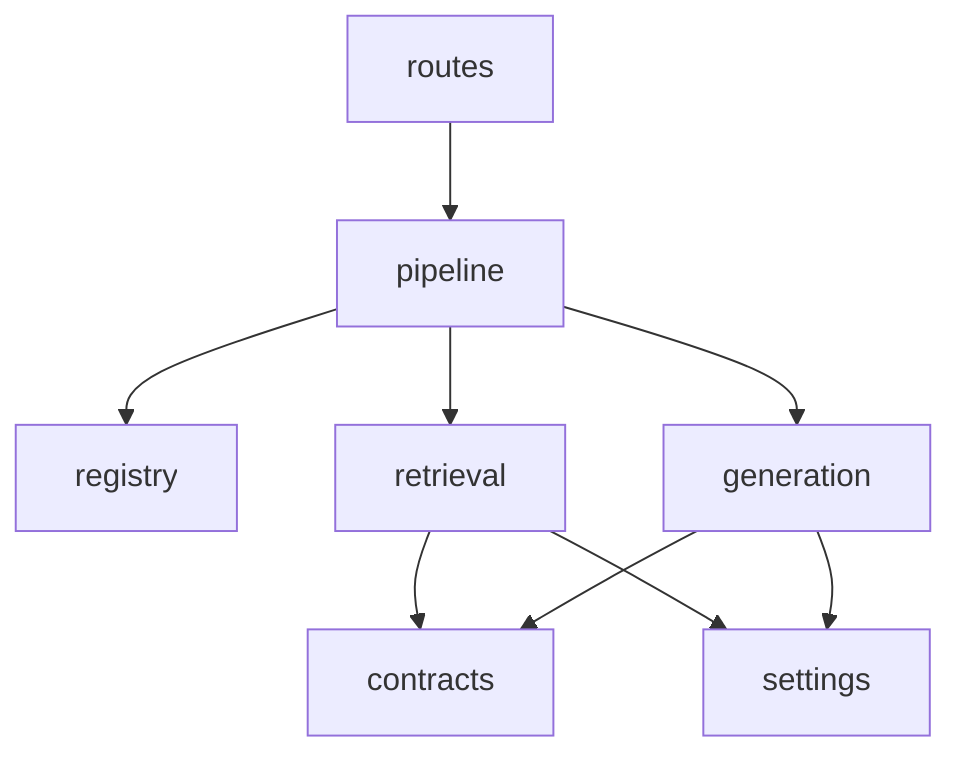
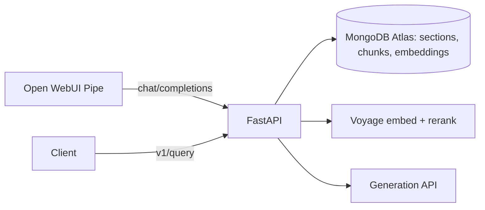

# Architecture Spine — buildingIntelligence

## Design Paradigm

Strategy-per-mode pipeline. Each mode is one `run_*(QueryRequest) -> QueryResult` strategy; every mode shares one `retrieve → answer_events` path. Contracts grow additively.

| Layer | Path |
| --- | --- |
| Transport | `routes/` (query, chat, models, health), `app.py` |
| Orchestration | `pipeline.py`, `registry.py` |
| Retrieval strategies | `retrieval/` (semantic, hybrid, rerank, structured) |
| Generation | `generation/` (context, answer) |
| Contracts / config | `contracts.py`, `settings.py` |
| Offline ingestion | `ingestion/`, `scripts/` |

## Invariants & Rules



Strategies never import each other except hybrid-reranked → hybrid; nothing imports `routes`.

### AD-1 — One shared path [ADOPTED]

- **Binds:** all modes, `/v1/query`, `/v1/chat/completions`
- **Prevents:** per-endpoint or per-mode duplicate retrieval/answer logic
- **Rule:** both endpoints call `pipeline.retrieve` then `answer_events`; a new mode is one strategy plus one `retrieve` dispatch branch and `REAL_PATTERNS` entry.

### AD-2 — Registry is the mode list [ADOPTED]

- **Binds:** `registry.py`, `/v1/models`
- **Prevents:** renamed or extra modes/model IDs
- **Rule:** six modes `rag-<pattern>`; stories add behavior, never entries or renames. `decomposition` and `hyde` stay `not_implemented` placeholders until their stories.

### AD-3 — Additive contracts [ADOPTED]

- **Binds:** `contracts.py`, `docs/architecture.md`
- **Prevents:** breaking clients, parallel result shapes
- **Rule:** `QueryRequest`/`QueryResult`/`RetrievedChunk`/`GenerationResult` only gain optional fields (None/empty by default); no rename, removal, or parallel top-level fields. Change needs user approval.

### AD-4 — Explicit mode, no fallback [ADOPTED]

- **Binds:** all retrieval strategies
- **Prevents:** silently degraded results labelled as another mode
- **Rule:** the caller picks the mode; failure is 503 `retrieval_not_ready` / 502 `retrieval_upstream_error` / 422; never fall back to or relabel another mode. Empty results are `no_results` (HTTP 200).

### AD-5 — Evidence is data, answers are grounded [ADOPTED]

- **Binds:** `generation/`, all modes
- **Prevents:** prompt injection, unsupported claims
- **Rule:** only BNS/IPC passages are evidence; passages are never instructions; every claim carries a cited `E<n>` label; citations resolve only from supplied context (≤5 passages, ≤12,000 chars, never cut); validation retries once (`MAX_ATTEMPTS = 2`); non-answered outcomes are HTTP 200 with empty `text`.

### AD-6 — Identity and scope are server-owned [ADOPTED]

- **Binds:** retrieval filters, chat adapter
- **Prevents:** client-driven privilege or identity
- **Rule:** `access_level` fixed to `public`; `caller_id`/`generate_answer` set server-side for chat; caller filters only narrow (`$in`); raw question text and request operators never enter a MongoDB predicate.

### AD-7 — Fixed model choices [ADOPTED]

- **Binds:** ingestion, semantic/hybrid retrieval, rerank
- **Prevents:** mixed embedding spaces, provider variants
- **Rule:** embeddings `voyage-3.5`, 1,024 dims, for every document and query; rerank is a separate `RERANK_*` call, never the embedding model; no provider-specific alternatives.

### AD-8 — Act-qualified identity [ADOPTED]

- **Binds:** corpus, `RetrievedChunk`, citations
- **Prevents:** BNS/IPC section confusion
- **Rule:** section IDs are `bns:<n>` / `ipc:<n>`, never bare numbers; chunks fuse and cite by `chunk_id`.

### AD-9 — Config and secrets [ADOPTED]

- **Binds:** `settings.py`, `.env.example`
- **Prevents:** committed secrets, startup coupling
- **Rule:** all config via `Settings` from untracked `.env`; the app starts and serves `/healthz` with no credentials; credentials are checked when a request needs them; none in code, responses, or logs.

### AD-10 — Corpus swaps are atomic [ADOPTED]

- **Binds:** ingestion
- **Prevents:** mixed PDF versions in one act
- **Rule:** a changed source hash regenerates that act's corpus as an atomic replacement.

## Consistency Conventions

| Concern | Convention |
| --- | --- |
| Naming | modes `kebab-case`; model IDs `rag-<mode>`; settings `UPPER_SNAKE` env / `lower_snake` field |
| Data & formats | OpenAI-style error envelope on chat; errors use the code strings in AD-4; new trace keys additive under `trace` |
| State & cross-cutting | stateless request handling; no retries on provider calls except the single answer-validation retry; `httpx` for provider HTTP |
| Testing | `uv run pytest tests/test_<story>.py`; one test file per story |

## Stack

Versions are pyproject minimums; `uv.lock` is authoritative and not web re-verified this run.

| Name | Version |
| --- | --- |
| Python | ≥3.12 |
| FastAPI / uvicorn | ≥0.115 / ≥0.30 |
| Pydantic / pydantic-settings | ≥2.7 / ≥2.3 |
| MongoDB Atlas (pymongo) | ≥4.7 |
| voyageai | ≥0.5.0 (`voyage-3.5`, `rerank-2.5`) |
| pymupdf / langchain-text-splitters | ≥1.28.2 / ≥1.1.3 |
| httpx | ≥0.27 |
| Open WebUI | separate trainer-supplied client |

## Structural Seed



```text
src/building_with_rag/  routes/ retrieval/ generation/ ingestion/ pipeline.py registry.py contracts.py settings.py
```

Indexes: `vector_index` (vector) and `chunk_text_index` (Atlas Search) on `chunks`.

## Deferred

- `decomposition` and `hyde` modes: later stories; reuse-vs-own-retrieval undecided.
- Deployment, environments, monitoring: local `uv` + `.env` only for now.
- Multi-user authorization, evaluation harness: out of course scope.
- Automatic mode routing, score cutoffs, structured filter/aggregation execution.
